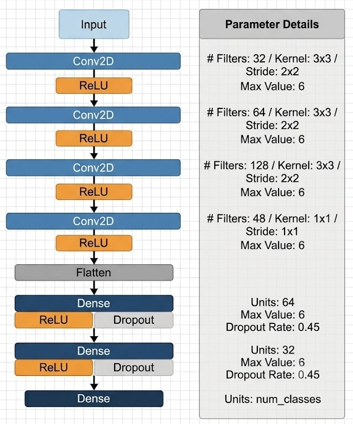
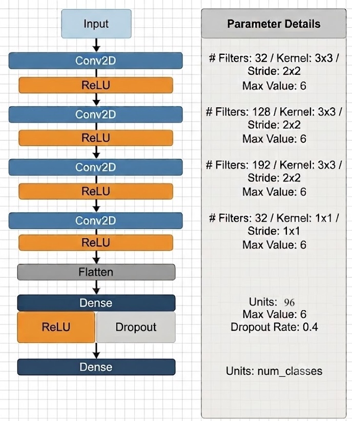

# On-edge motion recognition (MLiA 2026 - GU02_03)

## Introduction

This project implements a complete **Human Activity Recognition (HAR)** pipeline that runs on the **BrainChip Akida 1000** neuromorphic processor. HAR from wearable sensors is a key building block of Artificial Intelligence of Things (AIoT) applications (healthcare, fitness, ambient assisted living), but continuous inference on battery-powered wearables makes standard, power-hungry ANNs a poor fit.

Neuromorphic computing addresses this by using **Spiking Neural Networks (SNNs)**, which process information as sparse, asynchronous binary events (spikes) and therefore consume energy only when and where a spike is generated. We design a Convolutional Neural Network (CNN) that strictly respects the Akida 1.0 hardware constraints, train it in floating point, apply **Quantization-Aware Training (QAT)**, convert it to an SNN with `cnn2snn`, and deploy it on the
physical AKD1000 board.

We use the [**WISDM** dataset](https://archive.ics.uci.edu/dataset/507/wisdm+smartphone+and+smartwatch+activity+and+biometrics+dataset) (watch accelerometer + gyroscope, 20 Hz) and evaluate two scenarios:

- **Small (7 classes)**: a hand-oriented activity subset, used to benchmark against prior
  neuromorphic literature.
- **Big (18 classes)**: a broader subset used to stress-test model capacity, with the
  architecture and hyperparameters optimized via **Optuna**.

### Objective

Demonstrate that a complex HAR task can be deployed end-to-end on ultra-low-power neuromorphic
hardware while staying competitive with the literature. Concretely, the project:

1. Prepares and windows the WISDM watch data (2 s windows, 40 samples, 6 channels).
2. Designs a CNN that satisfies the Akida 1.0 constraints:
   - symmetric padding only (input pre-padded to odd dimensions `41 x 9`),
   - no pooling (dimensionality reduction via strided convolutions),
   - bounded activations (`ReLU6` instead of `ReLU`),
   - no Batch Normalization (avoids silent fusion errors at conversion),
   - a `1 x 1` pointwise convolution before `Flatten` to keep the model within on-chip SRAM.
3. Runs the three-phase deployment pipeline: **CNN training &rarr; Quantization and QAT (8/4/4 first layer,
   4/4/4 hidden layers) &rarr; SNN conversion (`.fb`) and hardware mapping**.
4. Uses **Optuna** to search architecture/hyperparameters (Big model) and QAT hyperparameters.

### Results (on physical Akida 1000)

<div align="center">

| Scenario          | # Params | Memory (MB) | Keras Float32 | Post-QAT | Akida (SNN) | Throughput (FPS) |
| ----------------- | -------: | ----------: | ------------: | -------: | ----------: | ---------------: |
| Small (7 classes) |  138,653 |        0.54 |        94.55% |   91.18% |      91.41% |         2,012.03 |
| Big (18 classes)  |  304,342 |        1.16 |        80.22% |   72.81% |      72.82% |         2,649.21 |

</div>

The 7-class result (91.41%) closely matches the ~92.5% baseline of Fra et al. [1] with a smaller
memory footprint, and shows **zero accuracy drop** between the software simulator and the physical
silicon. A detailed analysis is available in the accompanying project report/paper.

Below are the architectures of the generated convolutional neural networks for the Small and Big scenarios.

<div align="center">

|                             Small Model CNN                              |                            Big Model CNN                             |
| :----------------------------------------------------------------------: | :------------------------------------------------------------------: |
|  |  |

</div>


## Repository structure

```
.
├── src/                               # Data preparation, training, quantization and SNN conversion
│   ├── 01_Dataset_Exploration.ipynb   # Download WISDM, fuse sensors, window, normalize, save .npy
│   ├── 02_SmallModel_train.ipynb      # 7-class: manual CNN -> QAT -> Akida .fb
│   └── 03_BigModel_train_optuna.ipynb # 18-class: Optuna CNN + Optuna QAT -> Akida .fb
│
├── test/                              # Evaluation notebooks (CNN / quantized / Akida / hardware)
│   ├── Evaluation_SmallModel.ipynb
│   └── Evaluation_BigModel.ipynb
│
├── models/                            # Best trained models for each scenario
│   ├── small/                         # bestModel.h5, *_quantized.h5, *_quantized_akida.fb
│   └── big/                           # same as small, plus best_params/*.json (Optuna results)
│
├── images/                            # Architecture images, confusion matrices
│
├── requirements.txt                   # Dependencies for the project
├── LICENSE                            # BSD 3-Clause License
├── Report_MLiA26_GU02_03.pdf          # Project Report
└── README.md
```

The notebooks auto-detect the environment and set the `BASE_DIR` variable accordingly:
- In Colab, `BASE_DIR = './'` and everything lives under `/content/`;
- Locally, `BASE_DIR = '../'`, so paths resolve relative to the repo root when a notebook is executed from inside `src/` or `test/`. 

Raw data, preprocessed `.npy` files, and pretrained model artifacts are downloaded on demand via `gdown` when not already present.


## Reproducing the Experiments

### Prerequisites

- **Important (Apple Silicon / macOS users):** The BrainChip toolchain (`akida`, `cnn2snn`, `quantizeml`) is **not available for macOS**. Any step that involves quantization, SNN conversion, or the physical board requires a compatible environment (Linux/x86 or Google Colab).
- **Note:** physical-hardware execution requires access to an actual Akida AKD1000 device. Without it, you can still run Keras evaluations, quantized evaluations, and the Akida evaluation using the software simulator.
- **Python 3.10** (Recommended for the Akida toolchain)
- **Legacy Keras 2 backend:** The pipeline forces this via `os.environ["TF_USE_LEGACY_KERAS"] = "1"` at the top of the notebooks, because `cnn2snn` is incompatible with Keras 3.

### Installation

You can run the project either on Google Colab or on a local Linux/x86 machine.

#### Option A: Google Colab (Recommended)

The notebooks are designed to run seamlessly on Colab. 
1. Upload the notebook to Colab (or open it from the repository).
2. Run the first setup cell. When the `COLAB` environment is detected, it will automatically download `requirements.txt` and install the dependencies.
3. Run the remaining cells. Datasets and pretrained models are fetched via `gdown` on demand.

#### Option B: Local Environment (Linux / x86_64)

If you prefer to run the project locally, we recommend using a Conda environment:

```sh
# Create and activate the environment
conda create -n har-akida python=3.10 -y
conda activate har-akida

# Install dependencies
pip install -r requirements.txt

# Register the kernel and launch Jupyter
python -m ipykernel install --user --name har-akida --display-name "har-akida"
jupyter lab
```

*Note: Launch Jupyter from the repository root (or from inside `src/` or `test/`) so that the relative paths (`BASE_DIR = '../'`) resolve correctly.*

### Usage

Follow this suggested order to reproduce the experiments:

1. **`src/01_Dataset_Exploration.ipynb`** \
  Downloads WISDM, aligns accelerometer and gyroscope data, builds 2-second windows, applies z-score normalization, and saves the processed `.npy` datasets. \
  *Note: This step is optional. The training notebooks will download the preprocessed `.npy` files directly if they are missing.*

2. **`src/02_SmallModel_train.ipynb`** \
  Trains the manually engineered 7-class CNN, runs Quantization-Aware Training (QAT), converts the model to an Akida `.fb` file, and saves artifacts under `models/small/`.

3. **`src/03_BigModel_train_optuna.ipynb`** \
  Runs Optuna to search for the best 18-class architecture and QAT hyperparameters (saved to `models/big/best_params/`). It trains, quantizes, converts the best model, and saves artifacts under `models/big/`.

4. **`test/Evaluation_SmallModel.ipynb`** and **`test/Evaluation_BigModel.ipynb`** \
  Evaluates each model (float32 CNN, quantized CNN model, Akida SNN with simulator, and Akida SNN with physical AKD1000 if present) and produces the confusion matrices.

> **Reproducibility:** The train/val/test splits are stratified with `random_state=42` (70% / 15% / 15%).


## Authors

- Giosuè Pinto (s342711, s342711@studenti.polito.it)
- Francesco Palmisani (s343429, s343429@studenti.polito.it)
- Riccardo Marconi (s342227, riccardo.marconi@studenti.polito.it)


## References

[1] V. Fra, E. Forno, R. Pignari, T. C. Stewart, E. Macii, and G. Urgese, "Human activity recognition: suitability of a neuromorphic approach for on-edge AIoT applications," *Neuromorphic Computing and Engineering*, vol. 2, no. 1, p. 014006, 2022. 
[https://doi.org/10.1088/2634-4386/ac4c38](https://doi.org/10.1088/2634-4386/ac4c38)


## License
This project is licensed under the BSD 3-Clause License - see the [LICENSE](LICENSE) file for details.
